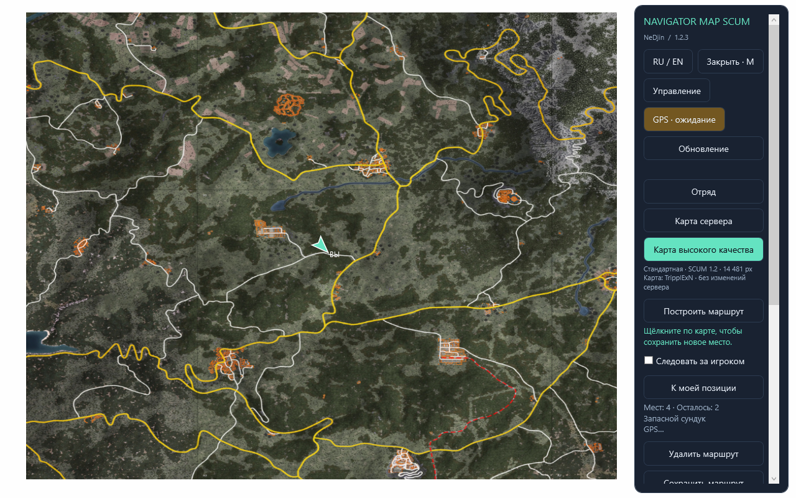
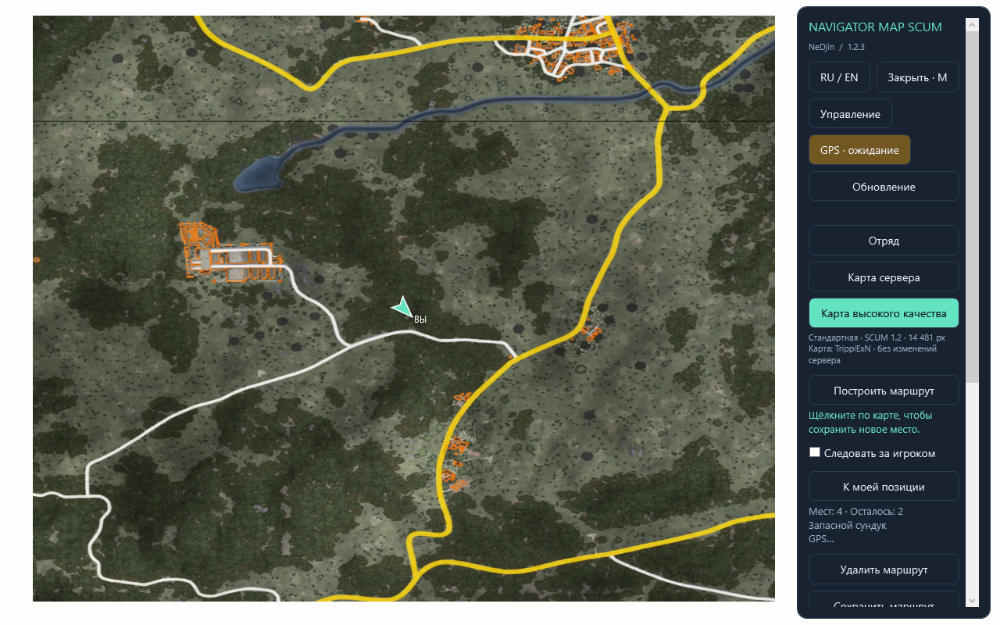
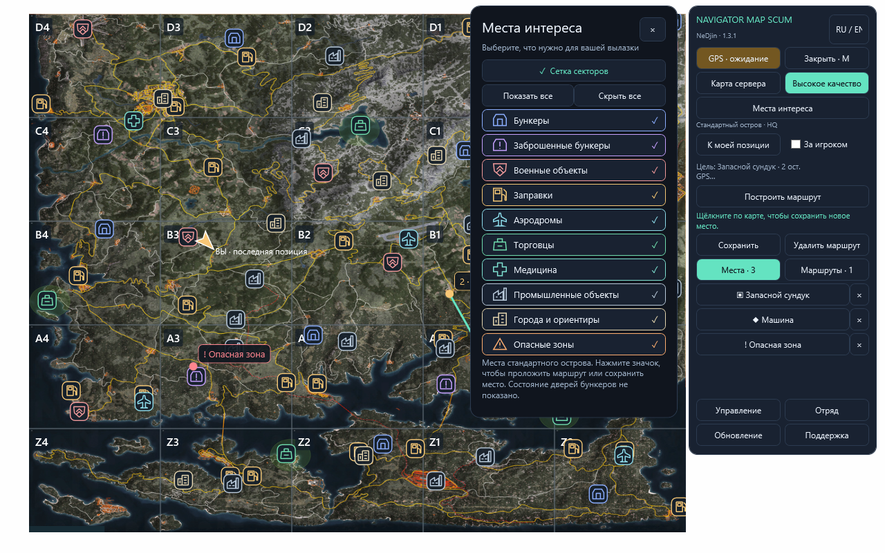

# Navigator Map Scum

**Удобный помощник для путешествий по SCUM от NeDjin.**

Сохраняйте дома, тайники и полезные места, прокладывайте маршруты и возвращайтесь туда, куда нужно. Меньше времени на поиски — больше на игру.

[**Скачать для Windows**](https://github.com/noginegun-web/navigator-map-scum-releases/releases/latest) · [Поддержка в Discord](https://discord.gg/kQwBDdzxEH)

**Последняя версия — 1.3.4.** Личная карта бесплатна. Доступ к отрядам активируется выданным ключом; приём оплаты пока не открыт.

## Что умеет Navigator

- Запоминает ваши места: название, значок и заметка для каждой точки.
- Помогает идти по маршруту: стрелка, расстояние и переход к следующей остановке.
- Позволяет приближать и свободно двигать карту. Ошиблись с отметкой? Просто перетащите её.
- Показывает карту текущей игры или подробную стандартную карту острова.
- Открывается вместе с картой по **M**. Управление всегда под рукой в боковой панели.
- Работает на русском и английском языках.

Личная карта, ваши точки и маршруты **бесплатны**. Navigator запускается отдельно от игры. Это независимый проект; правила использования сторонних помощников определяет администрация вашего игрового сервера.

## Новое в версии 1.3.3

**Исправление 1.3.4:** при выключении GPS стрелка и расстояние полностью скрываются. Включение GPS возвращает навигацию по сохранённому маршруту.

Обмен с отрядом теперь под рукой: после активации внизу карты появляются кнопки **«Обновить точки отряда»** и **«Передать свои точки»**. Можно пользоваться клавишами **F11** и **Shift+F11**. Вместе с местами передаётся ваша свежая GPS-позиция с отметкой времени; своё имя для карты задайте в разделе «Отряд».

Повторная передача не создаёт дубли уже общих мест и сохраняет правки товарищей. Каждый участник с активной подпиской может добавлять, двигать и удалять общие точки. Личные места остаются у вас.

## Карта и управление

Основные действия теперь помещаются в компактной панели. Места и сохранённые маршруты переключаются вкладками; длинный список прокручивается отдельно. Справка, отряд и фильтры открываются рядом и легко закрываются.

На подробной стандартной карте появились **сетка секторов и 75 мест интереса в 10 категориях**: бункеры, заброшенные бункеры, военные объекты, заправки, аэродромы и другие ориентиры. Выберите нужные категории, затем нажмите на значок: можно идти к нему, добавить его в маршрут или сохранить у себя. На изменённом сервере расположение объектов может отличаться.

Также улучшено открытие и перемещение карты, добавлена отмена скачивания обновления. Активацию можно повторить после обрыва связи; неверное приглашение не сбрасывает действующий доступ.

## Установка за пару минут

1. Откройте [последнюю версию](https://github.com/noginegun-web/navigator-map-scum-releases/releases/latest). Для первой установки скачайте **Navigator-Map-Scum-Setup-…exe**.
2. Запустите установщик и следуйте подсказкам.
3. Откройте Navigator с ярлыка на рабочем столе, затем запустите SCUM.
4. В игре используйте **оконный режим без рамки** и нажмите **M**.

Нужна Windows 10/11 x64. Обновить уже установленный Navigator можно файлом **Update** или кнопкой «Обновление» в приложении.

## Как пользоваться

| Действие | Как сделать |
|---|---|
| Открыть или закрыть карту | **M** |
| Закрыть интерфейс | **Esc** |
| Сохранить место | Щёлкните по свободному месту карты, выберите название и значок |
| Передвинуть точку | Зажмите на ней левую кнопку мыши и перетащите |
| Передвинуть карту | Зажмите левую кнопку на свободном месте и двигайте мышь |
| Приблизить или отдалить | Крутите колёсико мыши |
| Создать маршрут | «Построить маршрут» → отметьте остановки → «Готово» |
| Удалить маршрут | «Удалить маршрут»; личные сохранённые места останутся |
| Включить навигацию | Нажмите «GPS» и проверьте его состояние |
| Посмотреть подсказки | «Управление»; повторное нажатие или «Свернуть» убирает инструкцию |
| Выбрать бункеры, заправки и другие ориентиры | «Места интереса» → включите нужные категории |
| Отменить скачивание обновления | Нажмите «Отмена» на кнопке с процентом загрузки |
| Обновить выбранную карту отряда | F11 или «Обновить точки отряда» внизу панели |
| Передать свои места и позицию в отряд | Shift+F11 или «Передать свои точки» |

При свежих координатах GPS остановка маршрута переключается автоматически в пределах 50 метров. Если позиция временно недоступна, ориентируйтесь на состояние GPS в панели.

Клавиши отряда работают только в SCUM или на карте, вне ввода текста. Если F11 занята в ваших настройках игры или настройки нельзя проверить, используйте кнопки. В отряд отправляются сохранённые места; временные остановки маршрута не отправляются. Позиция передаётся разово, с временем получения GPS: если координаты старше 10 секунд, отправляются только места.

## Что даёт подписка

**Для тех, кто играет вместе: общие места на карте вашего отряда.** Один отметил тайник или точку встречи — остальные могут обновить карту и увидеть эту отметку. Личные точки при этом остаются при вас.

- Создавайте несколько отрядов — до **5**, до **50 участников** в каждом.
- Приглашайте друзей с активной подпиской или добавляйте их по ID.
- Вместе добавляйте, передвигайте и удаляйте общие отметки.
- Составом управляет создатель: только он может исключать участников. Каждый участник может выйти сам.
- После открытия продаж подтверждённая оплата будет выдавать доступ автоматически.

**Один ключ — одна установка Navigator.** После активации ключ нельзя передать другому игроку. Обновления сохраняют активацию; для переноса на другой компьютер обратитесь в поддержку.

Чтобы добавить общее место, откройте «Отряд», выберите свой отряд и режим «Точки отряда», затем поставьте отметку на карте. Все участники могут передвигать и удалять общие точки. Изменения сохраняются сразу; «Обновить общие точки» получает изменения товарищей. Личной отметкой можно поделиться через правую кнопку мыши.

| Срок | Цена |
|---|---:|
| 1 день | 50 ₽ |
| 7 дней | 150 ₽ |
| 14 дней | 250 ₽ |

**Сейчас доступ к отрядам выдаёт NeDjin по ключу.** Откройте «Отряд» и активируйте полученный ключ. Активный доступ нужен каждому участнику. Приём оплаты пока не открыт. После открытия продаж счёт будет выставляться в рублях; доступность иностранных карт зависит от платёжного сервиса и банка. Автоматических повторных списаний нет.

[Условия доступа и возврата](https://noginegun-web.github.io/navigator-map-scum-releases/terms.html) · [Обработка данных](https://noginegun-web.github.io/navigator-map-scum-releases/privacy.html)

## Нужна помощь?

[**Зайти в Discord NeDjin**](https://discord.gg/kQwBDdzxEH) — вопросы, предложения и сообщения об ошибках.

Автор: **NeDjin**. [Сведения о материалах](CREDITS.md).
